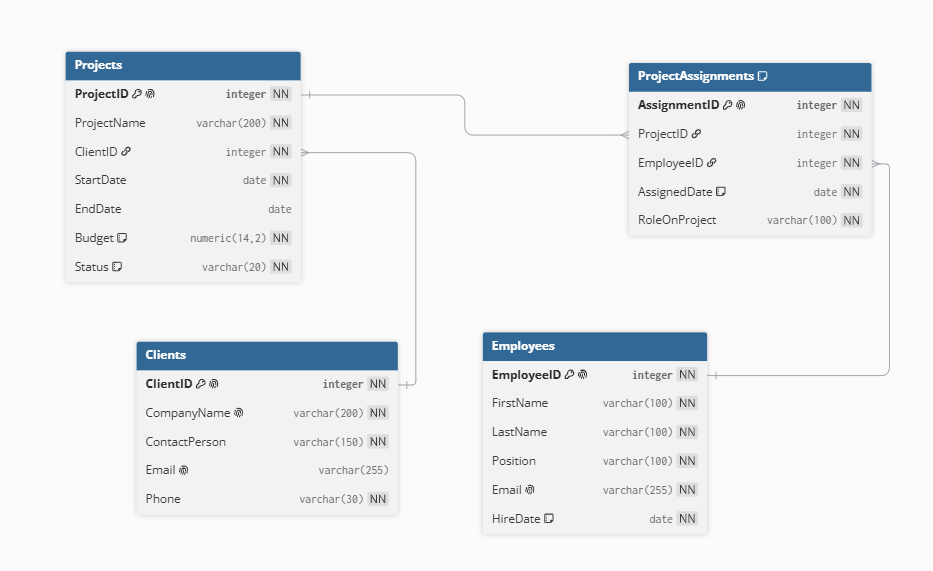

## Part 1: Выбор Сценария

Для данной работы выбран сценарий: **Управление строительными проектами**.  
Эта система будет управлять клиентами, сотрудниками, строительными проектами и назначением сотрудников на проекты.

## Part 2: Проектирование Базы Данных и Документация

### Идентификация Сущностей и Атрибутов

1. **Clients (Клиенты)** — заказчики строительных проектов.
2. **Employees (Сотрудники)** — сотрудники строительной компании.
3. **Projects (Проекты)** — строительные проекты, заказанные клиентами.
4. **ProjectAssignments (Назначения на проекты)** — таблица для реализации связи многие-ко-многим между сотрудниками и проектами.

### Проектирование Таблиц

#### 1. Table Name: Clients

- **Description:** Хранит информацию о клиентах-заказчиках строительных проектов.
- **Attributes:**
  - `ClientID`: INTEGER, PK, NOT NULL, UNIQUE
  - `CompanyName`: VARCHAR(200), NOT NULL
  - `ContactPerson`: VARCHAR(150), NOT NULL
  - `Email`: VARCHAR(255), UNIQUE
  - `Phone`: VARCHAR(30), NOT NULL
- **Constraints:**
  - `PK_Clients`: PRIMARY KEY (ClientID)
  - `UQ_Clients_CompanyName`: UNIQUE (CompanyName)
  - `UQ_Clients_Email`: UNIQUE (Email)

#### 2. Table Name: Employees

- **Description:** Хранит данные о сотрудниках строительной компании.
- **Attributes:**
  - `EmployeeID`: INTEGER, PK, NOT NULL, UNIQUE
  - `FirstName`: VARCHAR(100), NOT NULL
  - `LastName`: VARCHAR(100), NOT NULL
  - `Position`: VARCHAR(100), NOT NULL
  - `Email`: VARCHAR(255), NOT NULL, UNIQUE
  - `HireDate`: DATE, NOT NULL, DEFAULT CURRENT_DATE
- **Constraints:**
  - `PK_Employees`: PRIMARY KEY (EmployeeID)
  - `UQ_Employees_Email`: UNIQUE (Email)

#### 3. Table Name: Projects

- **Description:** Содержит информацию о строительных проектах, заказанных клиентами.
- **Attributes:**
  - `ProjectID`: INTEGER, PK, NOT NULL, UNIQUE
  - `ProjectName`: VARCHAR(200), NOT NULL
  - `ClientID`: INTEGER, FK (REFERENCES Clients), NOT NULL
  - `StartDate`: DATE, NOT NULL
  - `EndDate`: DATE
  - `Budget`: NUMERIC(14,2), NOT NULL
  - `Status`: VARCHAR(20), NOT NULL, DEFAULT 'planned'
- **Constraints:**
  - `PK_Projects`: PRIMARY KEY (ProjectID)
  - `FK_Projects_Clients`: FOREIGN KEY (ClientID) REFERENCES Clients(ClientID)
  - `CHK_Projects_Budget`: CHECK (Budget > 0)
  - `CHK_Projects_Dates`: CHECK (EndDate IS NULL OR EndDate >= StartDate)
  - `CHK_Projects_Status`: CHECK (Status IN ('planned','in_progress','completed','cancelled'))

#### 4. Table Name: ProjectAssignments

- **Description:** Таблица для реализации связи многие-ко-многим между сотрудниками и проектами. Хранит информацию о том, какой сотрудник назначен на какой проект и в какой роли.
- **Attributes:**
  - `AssignmentID`: INTEGER, PK, NOT NULL, UNIQUE
  - `ProjectID`: INTEGER, FK (REFERENCES Projects), NOT NULL
  - `EmployeeID`: INTEGER, FK (REFERENCES Employees), NOT NULL
  - `AssignedDate`: DATE, NOT NULL, DEFAULT CURRENT_DATE
  - `RoleOnProject`: VARCHAR(100), NOT NULL
- **Constraints:**
  - `PK_ProjectAssignments`: PRIMARY KEY (AssignmentID)
  - `FK_PA_Projects`: FOREIGN KEY (ProjectID) REFERENCES Projects(ProjectID)
  - `FK_PA_Employees`: FOREIGN KEY (EmployeeID) REFERENCES Employees(EmployeeID)
  - `UQ_PA_ProjectEmployee`: UNIQUE (ProjectID, EmployeeID)

### Взаимосвязи

- **Clients и Projects (Один-ко-Многим):**  
  У одного клиента может быть множество проектов, но каждый проект относится к одному клиенту.  
  `Projects.ClientID` является внешним ключом, ссылающимся на `Clients.ClientID`.

- **Projects и Employees (Многие-ко-Многим через ProjectAssignments):**  
  Один проект может выполняться несколькими сотрудниками, и один сотрудник может участвовать в нескольких проектах.  
  - `ProjectAssignments.ProjectID` → `Projects.ProjectID`  
  - `ProjectAssignments.EmployeeID` → `Employees.EmployeeID`

- **Projects и ProjectAssignments (Один-ко-Многим):**  
  Один проект может иметь много записей о назначении сотрудников.

- **Employees и ProjectAssignments (Один-ко-Многим):**  
  Один сотрудник может иметь много записей о назначении на проекты.

## Part 3: ER-Диаграмма

ER-диаграмма спроектированной базы данных представлена в файле `er_diagram.png`, приложенном к домашнему заданию.  
На диаграмме отражены все таблицы, их атрибуты, типы данных, первичные и внешние ключи, а также связи между сущностями.
