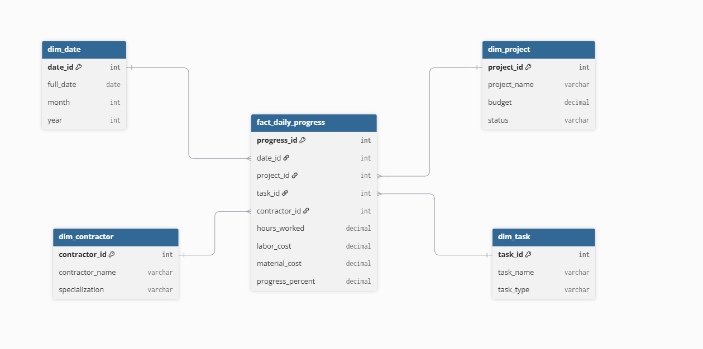

Lesson 5 — Data Warehouse

Business process: Tracking daily progress and costs at a construction site.

Level of detail (Grain): One day of work on a specific task by a specific contractor for a specific project. In other words, a single row in the fact table represents a one-day report for a single task.

Dimension tables:

dim_project — project information.

dim_task — specific task information.

dim_contractor — contractor/worker information.

dim_date — date for convenient time-based filtering.

Fact table: fact_daily_progress.

Physical model: Star schema. I chose this because it simplifies analytics and JOIN operations.

Lesson 5 — Data Warehouse
Business domain: Construction Project Management

Business process: Daily tracking of construction project progress and expenses.

Grain: One day of work for one task performed by one contractor on one project. One row in fact_daily_progress represents a daily record for a specific task, contractor, project, and date.

Data warehouse model: The physical model uses a Star Schema.
this schema because it simplifies analytics and JOIN operations.

Dimension tables:
dim_project: Stores information about construction projects.
-Column	Description:
project_id	Unique project identifier
project_name	Project name
budget	Project budget
status	Current project status

dim_task: Stores information about individual construction tasks.
-Column	Description
task_id	Unique task identifier
task_name	Task name
task_type	Type of construction task

dim_contractor: Stores information about contractors or workers involved in the project.
-Column	Description
contractor_id	Unique contractor identifier
contractor_name	Contractor name
specialization	Contractor specialization

dim_date: Stores calendar information used for time-based analysis.
-Column	Description
date_id	Unique date identifier
full_date	Full calendar date
month	Month number
year	Year

Fact table: fact_daily_progress
-The fact table stores daily operational metrics for construction work.
-Column	Description
progress_id	Unique fact record identifier
date_id	Reference to dim_date
project_id	Reference to dim_project
task_id	Reference to dim_task
contractor_id	Reference to dim_contractor
hours_worked	Number of hours worked
labor_cost	Labor cost for the record
material_cost	Material cost for the record
progress_percent	Recorded task progress percentage. The grain includes the contractor - this value reflects the total task progress as reported by this specific contractor on a given day

The foreign keys connect the fact table to all four dimensions and allow the metrics to be analyzed by project, task, contractor, and date.

Analytical queries:
1. Total project spending
Question: How much has been spent on each project compared with its budget?
-The query calculates total labor and material costs for each project and shows the project budget next to the spending value.

2. Contractor workload
Question: Which contractor worked the most hours in 2026?
-The query aggregates worked hours by contractor and sorts the result from the highest workload to the lowest.

3. Most expensive tasks
Question: Which three construction tasks have the highest total cost?
-The query combines labor and material costs and returns the top three tasks by total cost.

4. Recorded progress by task
Question: What is the latest recorded progress percentage for each task in a specific project?
-The query finds the most recent chronological record based on the date and returns the latest progress_percent reported for each task in project 1.